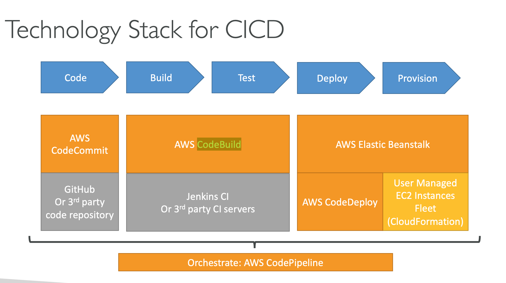

## iteablue & udemy

# IAM

AWS IAM还拥有如下特点：

- AWS账号管理的中央控制，IAM可以统一管理AWS的所有账号，权限问题
- 分享AWS的访问权限给其他用户
- 精细的访问权限控制，每一个用户都可以被赋予不同的访问权限
- 可通过**角色（Role）**安全地赋予AWS服务访问另一个AWS服务的权限
- Identity Federation ，通过与AD，Facebook，Google等第三方机构认证，赋予用户短暂的AWS权限
- 多重认证/MFA (Multi-Factor Authentication)，在登陆AWS管理平台的时候，除了使用用户名/密码之外，还可以另外提供软件Token来认证，进一步提高了安全性
- 可赋予用户/设备和服务短暂的访问权限
- 可自定义密码复杂度策略（密码多少位，需不需要包含大小写字母和数字，多久过期等）
- 和几乎所有AWS的服务都能集成
- 支持PCI DSS规范

## 重点名词

- 用户（User）：

  代表访问AWS的终端用户

  - 可使用**密码**来访问AWS管理平台
  - 可使用**Access Key ID和Secret Access Key**并通过API, CLI或SDK的形式来访问AWS服务（主要针对应用程序对AWS资源的访问）
  - 默认用户没有任何权限，我们需要用策略赋予每个用户**所需要的最小权限**

- 组（Group）

  ：拥有相同权限的用户组合

  - 拥有相同权限的用户可以归入一个组，方便权限的统一管理和控制
  - 一个组可以拥有多个用户，一个用户可以属于多个组

- 角色（Role）

  ：角色可以分配给AWS服务，让AWS服务有访问其他AWS资源的权限

  - 角色不包含任何用户名/密码
  - 角色比用户更加安全可靠，因为没有泄露用户名/密码或者Access Key的可能性
  - 举个例子，我们可以赋予EC2实例一个角色，让其有访问S3的读写权限（后面课程会有关于这一点的实操）

- 策略（Policy）

  ：定义具体访问权限的文档

  - 策略具体定义了能访问哪些AWS资源，并且能执行哪些操作（比如List, Read, Write等）
  - 策略的文档以JSON的格式展现

##  EC2

[4.6EC2的存储类型 实例存储和EBS存储](https://iteablue.com/course/aws-certified-solutions-architect-associate/lessons/ec2-storage-type)

- ## 赋予AWS CLI权限

  

  仅仅安装了AWS CLI工具还不够，你必须给它赋予一定的权限，这样它才能访问AWS内的资源。有两个方法可以赋予AWS CLI权限：
  
1. 使用AWS IAM来创建一个新的**AWS用户**，赋予该用户一定的权限，并且为该用户创建AWS Access Key ID和AWS Secret Access Key的程序访问凭证。然后将凭证配置到AWS CLI上。
  2. 使用AWS IAM创建一个新的**AWS角色**，赋予该角色一定的权限，然后将这个角色赋予到使用Amazon Linux AMI创建的EC2实例上。

  第一种方法适用于任何装有AWS CLI工具的客户端，甚至是自己的个人电脑。但一定不要泄露AWS Access Key ID和AWS Secret Access Key，否则别人可以使用这个凭证来随意在你的AWS上创建/使用资源。**也不要把这些凭证放在Github上**！

  第二种方法适用于装有AWS CLI的EC2实例，这是被认为最安全的一种方式。

- ## auto scaling group 终止实例

  按最多的 most instances in AZ， 最老的 oldest lunch configuration，最贵的 close to next billing hour先后顺序终止实例

- ## Placement Group的特点

  - EC2 Placement Group分为

    集群置放群组（Cluster Placement Group）

    、

    分布置放群组（Spread Placement Group）

    和

    分区置放群组（Partition Placement Group）

    - 集群置放群组（Cluster Placement Group）即传统的置放群组，所有的实例需要在同一个可用区内
    - 分布置放群组（Spread Placement Group）是将实例分布到不同的底层硬件，可以在不同的可用区内。你最多可以在每一个置放群组的每一个可用区内创建7个实例
    - 分区置放群组（Partition Placement Group）确保了置放群组中的每个分区具有自己的一组机架，每个机架具有自己的网络和电源.   
    
    
# ENI attach to EC2 

  

  An elastic network interface (ENI) is a logical networking component in a VPC that represents a virtual network 

  card. You can attach a network interface to an EC2 instance in the following ways:

  When it's running (hot attach)

  When it's stopped (warm attach)

  When the instance is being launched (cold attach).

# Elastic Beanstalk

## EKS

EKS on EC2 and EKS on Fargate

Task is like a running docker container or Pod, Task defination is like docker file which defines CPU, Memory , port, resource used .

#### Trigger ->Lambda

#  SIMPLE STORAGE SERVICE (S3), GLACIER, CLOUDFRONT – 存储服务

- Glaicer, S3-IA 虽然便宜，可是有最短收费存储时间限制。如果你存时间很短其实比s3 standard 贵

## ALB+Route53+AuotScalingGroup

- choose VPC->public subnet-> create target group->add/register ec2 instance in target group
- on Route53, create a record set pointing to this ALB(you have to choose routing policy)
- on EC2 console->create  AMI image from existing ec2 instance
- click Auto Scaling Group -> launch configuration'->choose AMI created from previous step-> setting for launch configuration-setting for creating Auto Scaling Group, e.g VPC, public subnet, etc->attach   auto scaling group to ALB created from above step-> when auto scaling group has event changed (instance starting fail /success), it could use sns to send message

# 6 vpc 

-VPC Endpoint  / Private Link

在一般的情况下，如果你需要访问S3服务，EC2实例或者DynamoDB的资源，你需要通过Internet公网来访问这些服务。有没有更快速、更安全的访问方式呢？

**VPC终端节点（VPC Endpoints）**提供了这种可能性。

VPC终端节点能建立VPC和一些AWS服务之间的高速、私密的“专线”。这个专线叫做PrivateLink，使用了这个技术，你无需再使用Internet网关、NAT网关、VPN或AWS Direct Connect连接就可以访问到一些AWS资源了！

**终端节点（Endpoints）**是虚拟设备，它是以能够自动水平扩展、高度冗余、高度可用的VPC组件设计而成，你也不需要为它的带宽限制和故障而有任何担忧。

**AWS PrivateLink**是专为客户设计用于特定用途的AWS内网，它采用了高度可用并且可扩展的架构（意味着你无需再为PrivateLink的性能和高可用性做任何额外架构设计）。

VPC终端有两种类型：**接口**和**网关**

其中接口类型支持以下服务（了解即可）：

- Amazon CloudWatch Logs
- AWS CodeBuild
- Amazon EC2 API
- Elastic Load Balancing API
- AWS Key Management Service
- Amazon Kinesis Data Streams
- AWS Service Catalog
- Amazon SNS
- AWS Systems Manager
- 其他 AWS 账户托管的终端节点服务
- 支持的 AWS Marketplace 合作伙伴服务

网关类型支持以下服务（需要记住）：

- **Amazon S3**

- **DynamoDB**

  

## VPN连接和Direct Connect的区别

- VPN连接可以在数分钟之内就搭建成功。如果有紧急的业务需求，可以使用VPN连接。VPN连接是基于互联网线路的，因此带宽不高，稳定性也不好，但价格便宜

- AWS Direct Connect使用的是专线，你的数据不会跑在互联网上，是私有的、安全的网络

  

  

  

  

  

#### Explanation

By default, instances that you launch into a virtual private cloud (VPC) can't communicate with your own network. You can enable access to your network from your VPC by attaching a virtual private gateway to the VPC, creating a custom route table, updating your security group rules, and creating an AWS managed VPN connection.

Although the term *VPN connection* is a general term, in the Amazon VPC documentation, a VPN connection refers to the connection between your VPC and your own network. AWS supports Internet Protocol security (IPsec) VPN connections.

A *customer gateway* is a physical device or software application on your side of the VPN connection.

To create a VPN connection, you must create a customer gateway resource in AWS, which provides information to AWS about your customer gateway device. Next, you have to set up an Internet-routable IP address (static) of the customer gateway's external interface.

The following diagram illustrates single VPN connections. The VPC has an attached virtual private gateway, and your remote network includes a customer gateway, which you must configure to enable the VPN connection. You set up the routing so that any traffic from the VPC bound for your network is routed to the virtual private gateway.

# Dynamo DB, RDS

Dynamo DB autoscaling is not enabled by default, you can use AWS CLI to enable it.

Enable DAX (Dynamo DB Accelerator) can increate maximum prvisioned read and write capacity,  is a fully managed, highly available, in-memory cache for DynamoDB that delivers up to a 10x performance improvement – from milliseconds to microseconds – even at millions of requests per second. DAX does all the heavy lifting required to add in-memory acceleration to your DynamoDB tables, without requiring developers to manage cache invalidation, data population, or cluster management.

**Amazon EMR** provides you a managed Hadoop framework that makes it easy, fast, and cost-effective to process vast amounts of data across dynamically scalable Amazon EC2 instances. You can access the operating system of these EC2 instances that were created by Amazon EMR.

**Amazon Athena**, **DynamoDB**, and **Amazon Neptune** are incorrect as these are managed services, which means that AWS manages the underlying operating system and other server configurations that these databases use.

Amazon **Redshift** is a relational, OLAP-style database. It's a data warehouse built for the cloud, to run the most complex analytical workloads. Amazon **Redshift Spectrum** is a feature of Amazon **Redshift**. **Spectrum** is a query processing engine that allows to join data that sits in Amazon S3 with data in Amazon **Redshift**.

# Cloud Watch, Cloud Trail, X-Ray

CloudWatch has available Amazon EC2 Metrics for you to use for monitoring CPU utilization, Network utilization, Disk performance, and Disk Reads/Writes. In case that you need to monitor the below items, you need to prepare a custom metric using a Perl or other shell script, as there are no ready to use metrics for these:

Memory utilization

disk swap utilization

disk space utilization

page file utilization

log collection

Take note that there is a multi-platform CloudWatch agent which can be installed on both Linux and Windows-based instances. You can use a single agent to collect both system metrics and log files from Amazon EC2 instances and on-premises servers. This agent supports both Windows Server and Linux and enables you to select the metrics to be collected, including sub-resource metrics such as per-CPU core. It is recommended that you use the new agent instead of the older monitoring scripts to collect metrics and logs.

# Security

- AWS 

  The shared responsibility model for infrastructure services, such as Amazon Elastic Compute Cloud (Amazon EC2) for example, specifies that AWS manages the security of the following assets:

  Facilities

  Physical security of hardware

  Network infrastructure

  Virtualization infrastructure

- Customer

  You as the customer are responsible for the security of the following assets:

  Amazon Machine Images (AMIs)

  Operating systems

  Applications

  Data in transit

  Data at rest

  Data stores

  Credentials

  Policies and configuration 

# 应用服务

## Kinesis服务

Kinesis目前有不同的功能服务，我们需要了解每一个服务有什么不同。这些服务分别是：

- **Kinesis Data Streams (Kinesis Streams)**：使用自定义的应用程序分析数据流
- **Kinesis Video Streams**：捕获、处理并存储视频流用于分析和机器学习（Machine Learning）
- **Kinesis Data Firehose**：将数据加载到AWS数据存储上
- **Kinesis Data Analytics**：使用SQL分析数据流

## **Kinesis Data Streams**

**Amazon Kinesis Data Streams**可以实时收集和处理大型数据流，这些数据会被处理并且发送到多种AWS服务中去，也可以生成报警、动态更改定价和广告战略等。

如图所示，**创建者（Producer）**会持续将数据推送到Kinesis Data Streams中，这些创建者包括了EC2实例、用户的PC终端、移动终端，服务器等。

Kinesis Data Streams由一组**分片（Shards）**组成，每个shards都有一系列的数据记录，每一个数据记录都有一个分配好的序列号。

数据记录在添加到流之后会保存一定的时间，这个**保留周期（Retention Period）**默认是**24小时**，但可以手动设置为**最多7天**。

**使用者（Comsumer）**会实时地对Kinesis Streams里的内容进行处理，并将最终结果推送到AWS服务，例如Amazon S3，DynamoDB，Redshift，Amazon EMR或者Kinesis Firehose。

## **Kinesis Video Streams**

**Kinesis Video Streams**主要用来进行实时的视频处理，或者批量进行视频分析。

Kinesis Video Streams可以捕获来自多种设备类型的视频流数据（比如智能手机、网络摄像头、车载摄像头、无人机等）。

其工作的流程和Data Streams类似，如下图所示。

   

# Cloud Front CDN

# S3总结

- 知识点总结关于 s3 https://iteablue.com/course/aws-certified-solutions-architect-associate/lessons/s3-summar经过了一个章节的学习，相信大家对**AWS Simple Storage Service (S3)** 已经有了一定的了解。这一章节挨踢小茶主要会总结这一章节学过的一些内容，让大家可以“温故而知新”。

  S3的考试内容在助理级解决方案架构师的考试中出现的频率比较多，因此需要重点学习并且最好能多做实验。

  ## S3的基本特性

  - S3是一种

    对象存储

    ，你可以保存文件到S3存储桶上

    - 不能用来保存操作系统，用来保存操作系统的是块存储，比如EBS (Elastic Block Storage)

  - 每一个S3的文件大小可以从

     0 字节到 5TB

    - 使用**Single Operation**上传只能上传最大5 GB的文件
    - 使用**分段上传（Multipart Upload）**可以对文件进行分段上传，最大支持上传5 TB的文件

  - S3没有总文件容量的限制，即S3存储桶的容量是无限的

  - S3的文件存储在存储桶（Buckets）内，可以理解为文件夹

  - S3存储桶的命名是**全球唯一**的，不能和任何区域的任何账号内的S3存储桶同名

  - S3的URL区别

    - **普通的S3 URL**：https://s3.ap-northeast-2.amazonaws.com/aws-xiaopeiqing-com/index.html
    - **S3托管的静态网站URL**：http://aws-xiaopeiqing-com.**s3-website**.ap-northeast-2.amazonaws.com

  - S3拥有**99.99%（4个9）**的可用性（Availability）

  - S3拥有**99.999999999%（11个9）**的持久性（Durability）

  - 当成功写入一个文件到S3之后，你会得到一个**HTTP 200**的成功响应

  ## 数据一致性模型

  - 对

    新对象的PUTs

    操作具有

    写后读一致性（Read after Write consistency）

    - 即如果向S3存储桶写入一个新的文件（PUT操作），那么S3在返回HTTP 200成功状态前会先把数据同步到AWS的多个物理位置
    - 即向S3存储桶写入一个新的数据，马上就可以读取这个新的数据

  - 对

    覆盖PUTs

    操作以及

    DELETES

    操作具有

    最终一致性（Eventual consistency）

    - 对于文件的更新和删除，结果不会马上显现，但**最终**会显现
    - 如果对一个已有的数据进行覆盖（覆盖PUTS操作）然后马上尝试读取该数据，因为数据可能还没有同步，因此有可能读取到的是旧的数据
    - 如果删除一个已有的数据（DELETES操作）然后马上尝试读取该数据，因为数据可能还没有同步，因此有可能还能读到这个数据

  ## 不同的S3存储类型

  - **Standard – 默认的存储类：**如果上传对象时未注明则S3会分配这个类型的存储
  - **Reduced Redundancy – 低冗余存储（RRS）：**可用于存储可再生的数据，因为该类型的文件持久性最低，比如用来保存缩略图等
  - **Standard – IA（Infrequently Accessed）：**用于保存不经常访问的数据，但是需要访问的时候也能很快地访问到。存储的价格比标准S3便宜，但是读取的费用比标准的S3高，也因为如此才要把不经常访问的数据放到这种类型的S3上。并且数据跨了多个AWS地理位置。
  - **Onezone – IA：**同上，但数据只保存到一个AWS可用区内
  - **Glacier：**非常便宜，仅用于做归档。从Glacier读取数据需要花费3-5个小时。

  

  ## Key-Value store

  S3是基于对象的，每一个对象包括了这些参数

  - **键（Key）**：可以认为是数据的名字
  - **值（Value）**：表示数据本身
  - **版本号（Version ID）**：对于启用了版本控制的存储桶来说很重要
  - **元数据（Metadata）**：关于数据的描述，比如说数据的创建时间，更改时间，文件类型，文件大小等信息
  - **访问控制信息**：能管理对Bucket内文件的访问权限

  ## S3版本控制（Versioning）

  - 会保存一个文件的所有版本（包括所有写入历史和删除信息）
  - S3版本控制是一个很好的备份工具
  - 一旦开启了版本控制，就不能取消，只能进行暂停
  - 版本控制可以和生命周期管理想集成
  - 版本控制启动后可以使用MFA Delete功能，即在删除一个文件的时候需要另外提供Token信息（软Token或者硬件Token），以此增加文件的安全性，减少误删的概率
  - 跨区域复制（Cross Region Replication）需要源S3存储桶和，目的S3存储桶都开启版本控制

  ## S3生命周期管理（Lifecycle Management）

  - 生命周期管理可以和版本控制相结合
  - 可以对文件当前版本和历史版本起作用
  - 生命周期管理可以做到（X，Y，Z为自定义天数）
    - （转换操作）在文件创建的X天后将文件移动到**Standard – IA (Infrequently Accessed)**
    - （转换操作）再过Y天将文件移动到**Glacier**
    - （过期操作）再过Z天将文件永久删除

  ## Amazon CloudFront

  - **边缘站点（Edge Location）**：边缘站点是内容缓存的地方，它存在于多个网络服务提供商的机房，它和AWS区域和可用区是完全不一样的概念。截至2018年中，AWS目前一共有100多个边缘站点。
  - **源（Origin）**：这是CDN缓存的内容所使用的源，源可以是一个S3存储桶，可以是一个EC2实例，一个弹性负载均衡器（ELB）或Route53，甚至可以是AWS之外的资源。
  - **分配（Distribution）**：AWS CloudFront创建后的名字
  - 分配分为两种类型，分别是
    - **Web Distribution**：一般的网站应用
    - ***\*RTMP\** (Real-Time Messaging Protocol)**：媒体流
  - 你不只是可以从边缘站点读取数据，你还可以往边缘站点写入数据（比如上传一个文件），边缘站点会将你写入的数据同步到源上
  - 在CloudFront上的文件会被缓存在边缘节点，缓存的时间是**TTL（Time To Live）**。文件存在超过这个时间，缓存会被自动清除
  - 如果在到达TTL时间之前，你希望更新文件，那么你也可以**手动清除缓存**，但你将会被AWS**收取一定的费用**

  **AWS Global Accelerator vs CloudFront**
 • They both use the AWS global network and its edge locations around the world
  

• Both services integrate with AWS Shield for DDoS protection.

• CloudFront
   • Improves performance for both cacheable content (such as images and videos)

• Dynamiccontent(suchasAPIaccelerationanddynamicsitedelivery) • Content is served at the edge

• Global Accelerator
   • Improves performance for a wider ange of applications over TCP or UDP

  - Proxying packets at the edge to applications running in one or more AWS Regions.
- Goodfitfornon-HTTPusecases,suchasgaming(UDP),IoT(MQTT),orVoiceoverIP
  
  - Good for HTTP use cases that require static IP addresses
- GoodforHTTPusecasesthatrequireddeterministic,fastregionalfailover
  - 2 Anycast IP are created for your application

  ## S3安全和加密选项

  - 默认情况下，所有新创建的S3存储桶都是私有的，只有存储桶的创建者/拥有者才能访问
  
  - 你可以通过以下两个方法来控制S3存储桶的安全性

    - **桶策略（Bucket Policy）**
  - **访问控制列表（Access Control Lists）**
  
- S3存储桶的访问日志可以存到另一个S3存储桶里面，方便对日志进行查看
  
- 传输过程中的加密（In Transit）
  
  - 使用**SSL/TLS**加密
  
- 处于静态下的加密（At Rest）
  
    - 使用

      服务器端加密保护数据（Server Side Encryption，SSE)

      - **Amazon S3 托管密钥的服务器端加密 (SSE-S3) –** 使用256位AES-256加密标准进行加密，并且主密钥会定期轮换
    - **AWS KMS 托管密钥的服务器端加密 (SSE-KMS) –** 使用AWS提供的密钥管理系统，有更多的密钥管理能力
    
- **服务器端加密与客户提供的密钥一起使用 (SSE-C) –** 你来提供和管理加密密钥，S3负责加密和解密
      
  - 使用**客户端加密保护数据（Client Side Encryption）**
    
  ## Storage Gateway
  
  - **文件网关（File Gateway）**：通过 NFS 连接直接访问存储在 Amazon S3 或者 Amazon Glacier上的文件，并且本地进行缓存
  
- Volume Gateway
  
  ：使用 iSCSI 作为本地磁盘连接到本地服务器上，让本地服务器可以访问到 Amazon S3 内的文件，其中，Volume Gateway 又分为以下两种
  
  - **Stored Volumes**：所有的数据都将保存到本地，但是会异步地将数据备份到AWS S3上
    - **Cached Volumes**：所有的数据都会保存到S3，但是会将最经常访问的数据缓存到本地

  - **Tape Gateway**：用来取代传统的磁带备份，通过 Tape Gateway 可以使用NetBackup，Backup Exec或Veeam 等备份软件将文件备份到 Amazon S3 或者 Amazon Glacier 上
  
  ## Snowball
  

AWS提供了3种不同类型的Snowball。

  - Snowball
    - PB 级数据传输解决方案，可以在本地数据中心和 Amazon S3 之间进行数据的**导入和导出**
  - Snowball Edge
    - 在Snowball的基础上增加了计算的功能，你可以在Snowball上运行Lambda函数
  - Snowball Mobile
    - EB 级数据传输服务，是一辆用于传输数据的大卡车

  

  

  ****• Snowball cannot import to Glacier directly****
   • You have to use Amazon S3 first, and an S3 lifecycle policy****

  

  

  

  Storage Comparison

• S3: Object Storage
 • Glacier: Object Archival
 • EFS: Network File System for Linux instances, POSIX filesystem
 • FSx for Windows: Network File System for Windows servers
 • FSx for Lustre: High Performance Computing Linux file system
 • EBS volumes: Network storage for one EC2 instance at a time
 • Instance Storage: Physical storage for your EC2 instance (high IOPS)
 • Storage Gateway: File Gateway,Volume Gateway (cache & stored),Tape Gateway • Snowball / Snowmobile: to move large amount of data to the cloud, physically
 • Database: for specific workloads, usually with indexing and querying

  ## S3传输加速

  利用AWS CloudFront CDN网络的**边缘节点（Edge Locations）**加速S3传输的过程。

  ## S3静态网站

  - S3可以托管静态网站
  - 你不需要额外的服务器，EC2，ECS等等，是一种无服务的架构
  - 非常便宜并且动态伸缩
  - 只能托管静态网站，不能托管动态网站（例如PHP、JSP或者ASP.NET等）

# RDS

# 数据库总结

恭喜大家完成了一个章节关于RDS的学习！下面让挨踢小茶总结一下本章节主要学习的内容吧！

- **RDS – 联机事务处理OLTP（Online Transaction Processing）**，包括：
  - SQL Server
  - Oracle
  - MySQL Server
  - PostgreSQL
  - Aurora
  - MariaDB
- 非关系数据库DynamoDB
- 数据仓库RedShift – **联机分析处理OLAP（Online Analytics Processing）**
- Elasticache – 内存缓存，支持的引擎
  - Memcached
  - Redis

## Multi-AZ高可用

使用Multi-AZ部署模式，RDS会在不同的可用区内配置和维护一个主数据库和一个备用数据库，主数据库的数据会自动复制到备用数据库中。

在开启Multi-AZ的情况下，这个URL Endpoints会根据主/备数据库的健康状态自动解析到IP地址。对于应用程序来说，我们只需要连接这个URL地址即可。

**高可用的设置只是用来解决灾备的问题，并不能解决读取性能的问题；要提升数据库读取性能，我们需要用到Read Replicas。**

## 只读副本（Read Replicas）

我们可以在源数据库实例的基础上，复制一种新类型的数据库实例，称之为**只读副本（Read Replicas）**。我们对源数据库的任何更新，都会**异步**更新到只读副本中。

因此，我们可以将应用程序的数据库读取功能转移到Read Replicas上，来减轻源数据库的负载。

RDS Read Replicas maximum 5, within AZ, cross AZ or Cross Region ( RDS read read replicas cross AZ or Cross Regions costs money), to reduce the cost , you can have your Read Replicas in same AZ

## Aurora

- Aurora会将你的数据**复制2份**到每一个可用区内，并且**复制到最少3个可用区**，因此你会有**6份数据库备份**
- 有两种数据库只读副本
  - Aurora Replicas（最多支持15个）
  - MySQL Replica（最多支持5个）
  - 两者的区别是Aurora主数据库出现故障的时候，Aurora Replicas可以自动变成主数据库，而MySQL Replica不可以

## DynamoDB

- 使用**SSD**存储
- 数据分散在3个不同地理位置的数据中心（并不是3个可用区）
- 最终一致性读取（Eventual Consistent Reads）
  - 默认的设置，即如果写入数据到DynamoDB之后马上读取该数据，可能会读取到旧的信息
  - DynamoDB需要时间（一秒内）把写入的数据同步到3个不同地理位置的数据中心
- 强一致性读取（Strongly Consistent Reads）
  - 在写入数据到DynamoDB之后马上读取该数据，会等所有写入操作以及数据同步全部完成后再回馈结果
  - 即强一致性读取一定会读到最新的数据结果
- 如果我们需要增加DynamoDB的规格，我们可以直接在AWS管理控制台上进行更改，并且**不会有任何系统downtime**

## RedShift

- **单节点**（160Gb）部署模式

- 多节点

  部署模式

  - **领导节点**：管理连接和接收请求
  - **计算节点**：存储数据，执行请求和计算任务，最多可以有128个计算节点

## Elasticache

Elasticache通过在内存中缓存数据来减少对象读取数据库的次数，减轻了数据库的负载，以及提高了网站的访问速度（内存的访问速度比磁盘的访问速度高很多）。一般来说我们会把相对来说更新频繁的“热数据”放在Elasticache中，把“冷数据”还是放在数据库中，以支持及时的更新。

目前Elasticache支持两种业界流行的引擎，分别是：

- Memcached
  - Memcached是一套高性能、分布式内存对象缓存系统，是一款开源的，非常流行的缓存系统
  - 使用AWS Elasticache可以和Memcached无缝地兼容
  
- **Redis**

  

  

  # AWS WAF – Web Application Firewall

  AWS WAF – Web Application Firewall

  • Protects your web applications from common web exploits (Layer 7) • Layer 7 is HTTP (vs Layer 4 is TCP)
   • Deploy on Application Load Balancer, API Gateway, CloudFront

  • Define Web ACL (Web Access Control List):
   • Rules can include: IP addresses, HTTP headers, HTTP body, or URI strings

  • Protects from common attack - SQL injection and Cross-Site Scripting (XSS) • Size constraints, geo-match (block countries)
   • Rate-based rules (to count occurrences of events) – for DDoS protection

  ​         

  

  # CI/CD

  

  

  

  

  

  # 跨账号访问权限（Cross Account Access）

  

  有了**跨账号访问权限（Cross Account Access）**，你可以在AWS管理控制台上或者使用AWS API/CL轻松地进行账号（角色）的切换，让你在不同的开发账号（角色）、测试账号（角色）、生产账号（角色）中进行快捷的切换。

  用户请求切换角色流程

  1. 可以在AWS控制台使用Switch Role的按钮切换到生产账号
  2. 或者使用AWS API/CLI，使用AssumeRole函数获取UpdateAPP角色的凭证

  - 管理员需要在IAM中创建一个新的角色UpdateAPP 角色的策略具体定义了允许访问名为productionapp的S3存储桶

  - 在开发账户中，管理员向开发人员组的成员授权切换角色的权限。向开发人员组授予针对UpdateApp角色调用**AWS Security Token Service (AWS STS) AssumeRole API** 的权限

  - 开发人员组的成员用户请求切换角

    > 可以在AWS控制台使用Switch Role的按钮切换到生产账号
    >
    > 或者使用AWS API/CLI，使用AssumeRole函数获取UpdateAPP角色的凭证

    

  -  AWS STS返回临时凭证

  - 临时凭证允许访问AWS资源，这样切换后的角色就可以访问productionapp的存储桶里的内容了。

  

  

  # Security Token Service

  使用**AWS Security Token Service (STS)**服务，你可以创建和控制对你的AWS资源访问的安全凭证。

  这种临时的凭证的工作方式和长期存在于AWS账户中的IAM用户的工作方式类似，但会存在以下的区别：

  - STS服务产生的凭证是**临时的**，它的有效期可以是几分钟到几小时，一旦过了这个时效时间，你的凭证就会失去作用，无法再访问相应的资源

  - IAM会长期保存在AWS账户中，而临时凭证只有在需要的时候才**动态生成**

    

  STS的临时凭证可以由以下几种方式产生：

  - 企业联合身份验证（Federation）

    - 使用了基于**Security Assertion Markup Language (SAML)** 的标准
    - 可以使用**微软Active Directory**的用户来获取临时权限，不需要创建IAM用户
    - 支持**单点登录（Single Sign On, SSO）**

  - Web联合身份验证（Federation with Mobile Apps）

    - 使用已知的第三方身份供应商（Amazon, Facebook, Google或其他OpenID提供商）来登录

  - 跨账户访问

    - 让一个账号内的用户访问同一个组织（Organization）内其他账号的AWS资源

    

  

  ## 知识点

  以上的步骤看起来感觉非常复杂，但在AWS助理解决方案架构师的考试中，我们不需要完全熟悉以上的所有步骤，只需要记住以下这些要点即可。

  - LDAP和AWS STS之间的通信需要通过Identity Broker (IdP)，而IdP一般需要自己开发
  - IdP总是先跟LDAP认证，审核用户名密码，然后再和STS通信
  - 应用程序最后会使用临时访问权限访问AWS的资源

  另外，STS和微软AD域集成的时候，可以做到用户使用自己企业LDAP目录的AD账号密码来登录AWS管理控制台。其中的Identity Broker位置变成了ADFS (Active Directory Federation Services)。

  

  

  

  

  

  已完成

  ## S3 FAQ

  一定要熟读S3的常见问题，https://aws.amazon.com/cn/s3/faqs/

下面是我自己从白皮书和国外论坛上总结的一百条知识点，考前看看用来帮助自己复习。

1. 大数据(MapReduce Kafka ETL日志处理 数据仓库 500MB/S)使用的磁盘I/A：Amazon EBS throughout optimized HDD volume

2. （上千张略缩图并且在过程中将临时数据写入存储）需要高速IO的磁盘(高速率的随机磁盘读写，长期一致的持久性)：Amazon EBS provisioned IOPS SSD volume

3. 对象存储：S3 ，S3不适用于频繁覆盖和删除，RDS最多的用处就是增删改查，所以如果数据要一直覆盖和删除，则需要RDS

4. I/O较低，偶尔会有小峰值：EBS通用SSD(gp2) General Purpose

5. Amazon Athena 数据库查询服务是一种无服务器交互式sql查询服务，让您能够轻松使用标准 SQL 进行 S3 数据库查询工作。

6. “Mount storage” keyword : EFS
   数据一致性与文件锁定 并行处理文件，都选择EFS
   EFS是文件存储，不是对象存储（S3）

7. 吞吐量经过优化的HDD（st1）卷提供了低成本的磁存储，该磁存储根据吞吐量而不是IOPS定义了性能。此卷类型非常适合大型连续工作负载，例如Amazon EMR，ETL，数据仓库和日志处理。

8. 冷HDD（sc1）卷提供了低成本的磁存储，该磁存储通过吞吐量而不是IOPS来定义性能。sc1具有比st1低的吞吐量限制，非常适合大型连续的冷数据工作负载

9. Glacier: 数据不可变，创建存档后便无法对其进行更新。

10. SNS+SQS组合。SQS将消息排队，SNS将它们推送到它们需要去的任何地方。可以防止瓶颈和单点故障

11. 移动/网络应用程序身份验证，想想 cognito和MFA

12. gateway VPC endpoint只用于DynamoDB和S3，剩下的其他服务都是用interface VPC endpoint

13. VPC flow logs:记录网络流量

14. 对S3进行加密并且不希望管理任何密钥就用SSE-S3

15. Cloudtrail 是用来记录API调用的,可以用来记录AWS的任何资源的行为审核日志
    确认实例终止原因可以使用Amazon CloudWatch代理将日志推送到Amazon CloudWatch日志

16. CloudWatch Logs用来解决日志问题

17. Elastic Beanstalk 将自动处理容量预配置、负载均衡、自动扩展及应用程序运行状况监控等部署详细工作。（还是会有EC2实例，只不过是自动管理）是非常好的web解决方案,比如node.js

18. Cloudwatch指标将仅向您显示特定于ELB本身的指标。而不是哪个src IP/客户端访问了该ELB上的特定服务。为此，您需要在ELB上启用访问日志。

19. 有多个app调用消费，并且公开为RESTful calls，那么就需要Kinesis Data Stream。SQS一般用来内部应用

20. AWS Systems Manager Parameter Store用来做配置和密码管理的,把那些个配置还有密码当做参数值来使用,某些服务中需要 使用到密码,那么就可以调用 AWS Systems Manager Parameter Store来获取相应的密码,这是AWs的一种解决方案。

21. 不接受停机时间的话，DynamoDB更适合存放用户的会话session数据，而且它是无线可扩展的(unlimited scalability) 支持TB级别的数据

22. 会话数据严格来说，放在缓存中最合适，所以选择 ElasticCache

23. 请求URL中基于路径的路由那就是ALB
    （WebSocket 、 HTTP/HTTPS）

24. 如果实例未能通过运行状况检查，则ALB将触发从新实例中删除，可以用来自动恢复服务
    如果您将一个或多个负载均衡或目标组附加到您的弹性伸缩组，则默认情况下，该组不会认为某个实例不健康，如果该实例未通过负载均衡健康检查，则会将其替换。
    但是，您可以选择将Auto Scaling组配置为使用弹性负载平衡运行状况检查。这样可以确保组可以根据负载均衡器提供的其他测试来确定实例的健康状况。负载均衡器定期发送ping、尝试连接或发送请求来测试EC2实例。这些测试被称为健康检查。

25. Reader endpoint仅对指向Aurora DB群集中可用Aurora副本的连接进行负载平衡

26. 将auto scaling组的健康检查类型更改为ELB，就可以确保标记为不正常的实例将被终止和替换，针对ELB进行健康检查可以检测到具体实例的数量，然后Auto scaling就会进行必要的调整

27. write-heavy 优化磁盘，比如对于RDS/NoSQL来说，优先选用Provisioned IOPS SSD
    read-heavy 考虑使用ElastiCache

28. 通过content metadata（内容元数据）进行流量路由则考虑Application Load Balancer

29. 如果应用程序访问S3对象仍然会读取到过时的数据，那么有可能应用程序通过使用相同的键覆盖现有对象来更新记录

30. 一般EC2和RDS都是走内网，外网通过ELB和NAT Gateway

31. an egress-only internet gateway可以用于专用子网中的实例建立到internet的IPV6通信

32. 最具弹性和成本效益的存储选择是S3

    每个AWS的EBS卷的最小大小是1 GiB

33. io1(provisoned IOPS SSD) 4 iGB = 200 IOPS 
    Volume(iGB) : IOPS = 1：50，

34. 在EBS中 4 IOPS = 1024 kb I/O
    I/O : IOPS = 256 : 1
    Amazon EBS每秒将每个/操作(即256B或更小)测量为一个IOPS。大于256KB的1/操作以256KB容量单位计算。

35. rds自动备份的最大保留期限为35天

36. 允许将读取工作卸载到只读副本的AWS平台：MariaDB、PostgreSQL

37. 可以通过在EC2上安装CloudWatch agent来实现监视EC2的内存使用情况，默认CloudWatch不包含内存监控

38. NLB一般用于TCP协议
    ALB一般用于HTTP/TPPS协议，但是功能性和性能不如NLB
    加密方式可以用NLB+TCP侦听器+SSL install on EC2
    或者ALB + HTTPS侦听器+SSL install on EC2 & ALB

39. 全局表依托 DynamoDB 的全球覆盖能力，为您提供完全托管的多区域、多主机数据库。这样您可以跨选择的 AWS 区域自动复制表的更新。

40. Amazon Athena 是一种交互式查询服务，让您能够轻松使用标准 SQL 分析 Amazon S3 中的数据。Athena 没有服务器，因此您无需管理任何基础设施，且只需为您运行的查询付费。可用于降低成本

41. VPC endpoint 端点是虚拟设备。可以用于将受保护的信息传输到不同的使用者中，并向特定服务使用者授予权限以创建链接。它们是横向扩展、冗余且高度可用的VPC组件，允许您的VPC中的实例与服务之间进行通信，而不会对您的网络流量造成可用性风险或带宽限制。

42. 可以通过设置加权路由策略，实现权重分流。并把DNS加入ELB中，也可以实现分流。

43. 可以通过UpdateShardCount命令来增加Kinesis Data Streams流中的分片数量

44. AWS PrivateLink 可用于访问AWS所有服务

45. Amazon Inspector代理，设计应用程序以将事件存储在应用程序日志文件中，可以使特定于应用程序的度量标准的事件记录下来。

46. Cluster群集是可以放置任务的容器实例的逻辑分组。
    容器实例是运行ECS代理并已注册到集群的EC2实例。
    任务定义是对包含一个或多个容器定义的应用程序的描述。
    调度程序是用于在容器实例上放置任务的方法。

47. **放置群组（置放群组）是单个可用区内的实例的逻辑分区，不能跨越多个可用区。**但是如果置放群组中启动了10个EC2实例，那么可以跨越同一区域中的多个可用区，因为每个群组在每个可用区中最多有7个正在运行的实例，10个EC2实例无法在一个可用区内放置，需要跨可用区， placement spread 7 instances per AZ

48. 如果要在策略声明中指定资源，可以在EC2中使用其Amazon Resource Name(ARN)

49. S3不提供搜索查询工具，可以使用自己的数据库系统来管理S3元数据和键映射来实现搜索。

50. 根据存储设备的容量是小于还是等于1TB还是大于1TB,导入Amazon EBS的结果将有所不同。**Amazon EBS快照的最大大 小为1TB。因此,如果设备映像大于1TB,则会对映像进行分块**并将其存储在 Amazon S3上。2TB的话则分到两个1TB对象的S3上

51. 可以使用Amazon Simple Email Service(Amazon SES)通过电子邮件将文件更改发送给用户

52. 密钥对仅用于Amazon EC2和CloudFront

53. 跨账户访问允许一个账户与另一个账户中的用户共享对其资源的访问

54. AWS Import/Export不支持从EBS和Glacier导出

55. 安全组的规则可以随时修改

56. 每个AWS账户每个区域的所有AWS账户限制为5个EIP（弹性IP地址）
    aws允许创建的Auto Scaling组的最大数量是20

57. 部分实例时间（partial instance-hours） 即不足一个计费时间单位 按 一个满计费单位（full hours）计算

58. 如果您的I/O延迟高于您的要求，请检查平均队列长度，以确保您的应用程序不会驱动比您预配置的更多的IOPS。您可以通过保持较低的平均队列长度（通过为卷配置更多的IOPS来实现）来保持较高的IOPS，同时降低延迟。

59. 当通过AutoScaling启动EC2 Classic实例的时候，EIP不可用
    如果您使用的是EC2-Classic，则必须使用专门为EC2-Classic创建的安全组。
    在EC2-Classic中启动实例时，必须在与实例相同的区域中指定安全组。
    在EC2-Classic中启动实例时，无法指定为VPC创建的安全组。

60. 如果想建立一个复杂的网络基础结构，简化部署、复制、控制、跟踪变更方面的工作，可以使用Cloud Formation

61. 托管区域中的资源记录集合不能具有不同的后缀，后缀必须相同

62. Amazon SQS支持每个用户无限数量的队列和毎个队列无限数量的消息。请注意, Amazon SQS会自动删除队列中超过4天的消息

63. 当Amazon ec2启动AM实例的启动顺序时,开始计费。当实例关闭时,计费结束。

64. 使用 Amazon Import/ Export时,需要为每个物理设备提交单独的作业请求,即使它们属于相同的导入或导出作业。

65. Amazon route53中,您无法为顶级域(TLD)创建托管区域

66. RDS使用的安全组为数据库安全组、VPC安全组、EC2安全组

67. M1实例比M3实例有更多的交换内存

68. 使用MQTT协议在层之间传递消息，可以使用Amazon MQ

69. 可以将虚拟专用网关连接到VPC并创建NAT网关，这样就可以在VPC中提供出站Internet连接，而又不向应用程序服务器提供入站Internet连接

70. Cloudfront不是任何加速都最快,如果访问者离S3最近, router53可以判断出直接去S3,不用去CDN绕行

71. 对 EBS 加密，首选 KMS

72. 使用CloudWatch TunnelState Metric来监视VPN连接打开还是关闭

73. 给 S3 中的 Bucket 中的文件加上 prefix 键名前缀，可以提升性能。

74. 灾难恢复用CloudFormation

75. S3可以用版本控制来支持跨区域复制

76. 用VPC flow logs记录通过VPN网路流量

77. 可以用CloudFront + S3的方式做权限管理

78. AWS Config可以查询AWS资源配置的详细信息

79. 访问子网数据库的方法：VPC IPsec VPN隧道 / 堡垒主机

80. S3用于WEB网站静态资源分享，EFS不能直接被访问， 需要通过EC2才能访问到EFS，所以共享Web上的文档，用S3

81. 通过CloudFront的OAI（原始访问身份）来限制用户访问S3上的限制内容

82. 使用ELB的health check来检查auto scaling中实例的运行情况

83. 只需使用VPN即可对通信进行端到端加密和保护，仅仅VPC peering不能实现端到端加密

84. 扩展更大的RDS实例类型 和 将读取查询重定向到RDS读取副本 来提高数据库性能，Auto Scaling并不能增加数据库性能

85. 将NAT网关添加到每个公共子网并更改专有子网的路由表，可以使专有子网的实例能访问Internet

86. 通过修改Auto Scaling组的冷却计时器 和 修改触发AutoScaling缩减策略的CloudWatch警报期限可以防止AutoScaling组同一时间放大和缩小

87. 使用 ALB 来进行安全证书的加载可以实现安全通信

88. Auto Scaling组的扩展频率 与 Auto Scaling组检测故障所需时长 决定了运行状态检查的宽限期

89. 利用 CDN 做区域权限隔离（限制某个地区访问资源）

90. 数据加密的最少运营开销的方法是自己在客户端加密

91. 使用AWS Batch功能创建具有默认模板的计划备份，然后每天自动备份到S3中，可以满足每天对DynamoDB表进行备份的需求

92. 看到用户桌面就想到桌面映像 和 VM import

93. 使用Oracle Data Pump导入复杂的数据库或大小为数百兆字节或几TB的数据库。

94. Amazon DynamoDB支持递增和递减原子操作

95. Amazon EBS支持的实例可能立即终止的一些原因：您已达到音量上限。AMI缺少必需的部分。快照已损坏。

96. 一个VPC可以跨越多个可用区。相反，子网必须位于单个可用区中

97. 带有AWS Marketplace产品代码的快照无法公开

98. 默认情况下ELB使用HTTP来检查实例的运行状况

99. 保管库清单是指保管库中的档案列表。下载文件库清单是异步操作， 可以使用SNS 在作业完成时通知您。

100. Amazon EMR始终使用HTTPS在Amazon S3和Amazon EC2之间发送数据，而不是IPsec

     

101. third-party ca 签发的certificate, 可以导入到**AWS Certificate Manager** and **IAM certificate store** 进行安全保存

102. redshift cluster 的disaster recovery : ecnable corss-region snapshots copy in amazon redshift cluster

103.  **cloud trail+ enable server access logging for all required Amazon S3 buckets.** : track and log every request access to their S3 buckets including the requester, bucket name, request time, request action, referrer, turnaround time, and error code information. The solution should also provide more visibility into the object-level operations of the bucket.

104. in RDS, the enhanced monitoring metrics provided for cloudwatch: 

     - rds child process, os process, os process

     in RDS, the regular items provided by RDS metrics in cloudwatch:

     - cpu utilization,database connections, freeable memory

105. Install the unified CloudWatch Logs agent in each instance which will automatically collect and push data to CloudWatch logs. Analzyze the log data with CloudWatch Logs Insights.

106. on E2 instance, CloudWatch monitoring script->send metrics to CloudWatch->trigger auto scaling group

107. Install the CloudWatch agent to the EC2 instances which will trigger your Auto Scaling group to scale up.

108.  AWS Step Functions  provides serverless orchestration for modern applications. it can  coordinate multiple AWS.           services into serverless workflows.

109. **SWF**  is a fully-managed state tracker and task coordinator service. 

110. AWS Lambda is for sererless computing. 

111. CDN + Lambda@Edge  deploy Lambd function globally , customerize the cdn content, code closer to users of your application, which improves performance and reduces latency.

112.  EBS vloumes attached to stopped EC2 still cost money, using an amazon VPC is free

113. Spot instance will be terminated when it goets interrupted by amazon ec2 for capacity requirement.

114. transit gateway: for having transitive peering between thousands of VPC and on-premises, hub-and-spoke(start) connection 

     

115. AWS Glue - Fully-managed ETL(Extract,Transform&Load) service

116. S3 read after write consistency for put of new object, evental consistency for delete and put of exisiting object

117. An **Auto Scaling group** can contain EC2 instances in one or more Availability Zones within the same **Region**. However, **Auto Scaling groups** cannot span multiple **Regions**. For **Auto Scaling groups** in a VPC, the EC2 instances are launched in subnets.

118. AWS Resource Access Manager (RAM) is a service that enables you to easily and securely share AWS resources with any AWS account or within your AWS Organization. You can share AWS Transit Gateways, Subnets, AWS License Manager configurations, and Amazon Route 53 Resolver rules resources with RAM.

119. AWS Opsworks

     - Chef & Puppet help you perform server configuration automatically, or repetitive actions
     - They work great with EC2 & On PremiseVM
     - AWS Opsworks = Managed Chef & Puppet
     - It’s an alternative to AWS SSM
     - No hands on here, no knowledge of chef and puppet needed
     - In the exam: Chef & Puppet needed => AWS Opsworks

120. Glacier Valut - Lock the policy for future edits(can no longer be changed), helpful for compliance and data retention 

121. EC2-Classic & AWS ClassicLink (deprecated)

     • EC2-Classic: instances run in a single network shared with other customers • Amazon VPC: your instances run logically isolated to your AWS account

     • ClassicLink allows you to link EC2-Classic instances to a VPC in your account • Must associate a security group
      • Enables communication using private IPv4 addresses
      • Removes the need to make use of public IPv4 addresses or Elastic IP addresses

     • Likely to be distractors at the exam © Stephane Maarek

122. **Simple routing policy** — Use for a single resource that performs a given function for your domain, for example, a web server that serves content for the example.com website.

123. **Weighted routing policy** — Use to route traffic to multiple resources in proportions that you specify.

124. **Latency routing policy** — Use when you have resources in multiple AWS Regions and you want to route traffic to the region that provides the best latency.

125. **Failover routing policy** — Use when you want to configure active-passive failover.

126. **Geolocation routing policy** — Use when you want to route traffic based on the location of your users.

127. **Geoproximity routing policy** — Use when you want to route traffic based on the location of your resources and, optionally, shift traffic from resources in one location to resources in another.

128. **Multivalue answer routing policy** — Use when you want Route 53 to respond to DNS queries with up to eight healthy records selected at random

129. Target Group vs Auto Scaling Group in AWS

     Target groups are just a group of Ec2 instances. Target groups are **closely associated with ELB and not ASG**.

     - ELB -> TG - > Group of Instances

     We can just use ELB and Target groups to route requests to EC2 instances. With this setup, there is no autoscaling which means instances cannot be added or removed when your load increases/decreases.

     - ELB -> TG - > ASG -> Group of Instances

     If you want autoscaling, you can **attach a TG to ASG** which in turn gets associated to ELB. Now with this setup, you get request routing and autoscaling together. **Real world usecases follow this pattern**. If you detach the target group from the Auto Scaling group, the instances are automatically deregistered from the target group

     
     
130. An Auto Scaling group can contain EC2 instances in one or more Availability Zones within the same Region. However, Auto Scaling groups cannot span multiple Regions. For Auto Scaling groups in a VPC, the EC2 instances are launched in subnets.

     VPC could not span multi regions, peering vpc also could not span multi regions

SAA-C02 140 Questions  

2, 4,8,9,11,25,28,31, 47,51, 52,53,54,56,58

71,81,83,84,92,93,97,102,108,125,137,140

# Jon Bonso' Mock Test1

Q38

migrate on-premise network public IP to your AWS account

Create a Route Origin Authorization(ROA) then once done, provison and advertise those public IP address range to your AWS Account 

Q40

Identity Broker (IdP) (Federation Proxy or IdentityProvider or  Active Directory Federation Services-for MSAD )

Q47

Amazon DynamoDB Accelerator (DAX) is a fully managed, highly available, in-memory cache that can reduce Amazon DynamoDB response times from milliseconds to microseconds, even at millions of requests per second.

Q49

a non-Serverless DB cluster for Aurora is called a provisioned DB cluster

Q54

When you use Amazon Redshift Enhanced VPC Routing, Amazon Redshift forces all COPY and UNLOAD traffic between your cluster and your data repositories through your Amazon VPC.

Q60

**You are using a combination of API Gateway and Lambda for the web services of your online web portal that is being accessed by hundreds of thousands of clients each day. Your company will be announcing a new revolutionary product and it is expected that your web portal will receive a massive number of visitors all around the globe. How can you protect your backend systems and applications from traffic spikes?**

Use throttling limits in API Gateway

Amazon API Gateway** provides throttling at multiple levels including global and by a service call. Throttling limits can be set for standard rates and bursts. For example, API owners can set a rate limit of 1,000 requests per second for a specific method in their REST APIs, and also configure Amazon API Gateway to handle a burst of 2,000 requests per second for a few seconds.

# Jon Bonso' Mock Test2

Q8 **An accounting application uses an RDS database configured with Multi-AZ deployments to improve availability. What would happen to RDS if the primary database instance fails?**

The canonical name record(CNAME) is switche from primary to standby instance.

***The IP address of the primary DB instance is switched to the standby DB instance\*** is incorrect since IP addresses are per subnet, and subnets cannot span multiple AZs.

Q47

Take note that you should use SNS instead of SES (Simple Email Service) when you want to monitor your EC2 instances.

Q51

As a Junior Software Engineer, you are developing a hotel reservations application and are given the task of improving the database aspect of the app. You found out that RDS does not satisfy the needs of your application because it does not scale as easily compared with DynamoDB. You need to demonstrate to your Senior Software Engineer the advantages of using DynamoDB over RDS.  

What are the valid use cases for Amazon DynamoDB? (Select TWO.)

**DynamoDB** is a NoSQL database that supports key-value and document data structures. A key-value store is a database service that provides support for storing, querying, and updating collections of objects that are identified using a key and values that contain the actual content being stored. Meanwhile, a document data store provides support for storing, querying, and updating items in a document format such as JSON, XML, and HTML.

**Managing web sessions** is correct because the DynamoDB Time-to-Live (TTL) mechanism enables you to manage web sessions of your application easily. It lets you set a specific timestamp to delete expired items from your tables. Once the timestamp expires, the corresponding item is marked as expired and is subsequently deleted from the table. By using this functionality, you do not have to track expired data and delete it manually. TTL can help you reduce storage usage and reduce the cost of storing data that is no longer relevant.

**Storing metadata for Amazon S3 objects** is correct because the Amazon DynamoDB stores structured data indexed by primary key and allow low latency read and write access to items ranging from 1 byte up to 400KB. Amazon S3 stores unstructured blobs and is suited for storing large objects up to 5 TB. In order to optimize your costs across AWS services, large objects or infrequently accessed data sets should be stored in Amazon S3, while smaller data elements or file pointers (possibly to Amazon S3 objects) are best saved in Amazon DynamoDB.

Q 65

**Throughput optimized HDD(std1)**, Low cost Big data , fast , intensive  throughput , freqeuent access 

**Cold HDD(sc1)** ,  Lowest cost, Throughput-oriented storage for large volumes of for data infrequently accessed workloads 

# Jon Bonso's Mock Test3

Q2

**Stopping the Reserved instances as soon as possible** is incorrect because a stopped instance can still be restarted. Take note that when a Reserved Instance expires, any instances that were covered by the Reserved Instance are billed at the on-demand price which costs significantly higher.

Q3

Hence, the correct answer is to **use the built-in Reader endpoint of the Amazon Aurora database.**

The option that says: **Use the built-in Cluster endpoint of the Amazon Aurora database** is incorrect because a cluster endpoint (also known as a writer endpoint) simply connects to the current primary DB instance for that DB cluster. This endpoint can perform write operations in the database such as DDL statements, which is perfect for handling production traffic but not suitable for handling queries for reporting since there will be no write database operations that will be sent.

The option that says: **Enable Amazon Aurora Parallel Query** is incorre

Q4

**RDS** is incorrect because this is just a "managed" service and not "fully managed". This means that you still have to handle the backups and other administrative tasks such as when the automated OS patching will take place.

**DynamoDB** is the best option to use in this scenario. It is a fully managed non-relational database service – you simply create a database table, set your target utilization for Auto Scaling, and let the service handle the rest. You no longer need to worry about database management tasks such as hardware or software provisioning, setup and configuration, software patching, operating a reliable, distributed database cluster, or partitioning data over multiple instances as you scale. DynamoDB also lets you backup and restore all your tables for data archival, helping you meet your corporate and governmental regulatory requirements.

Q20

dynamoDB autoscalinggroup is not default enabled

dynamoDB can enable global replication.

Q36

**What service must be used to easily capture, transform, and load streaming data into Amazon S3, Amazon Elasticsearch Service, and Splunk?**

Kinesis Data Firehose can 

Q40

AutoScalingGroup and ELB could not cross/span Regions 

Q62

The following VPC peering connection configurations are not supported.

Overlapping CIDR Blocks

Transitive Peering

Edge to Edge Routing Through a Gateway or Private Connection

# Jon Bonso' Mock Test4

Q9

AWS Global Accelerator

**The traffic should be routed to the closest edge location via an Anycast static IP address.**

***Amazon CloudFront\*** is incorrect because although this service uses edge locations, it doesn't have the capability to route the traffic to the closest edge location via an Anycast static IP address.

Q19

**You are instructed to implement a disaster recovery plan for the Redshift to ensure business continuity even in the event of an AWS region outage.**  

Enable Cross-Region Snapshots Copy in your Amzazon Reshfit Cluster

Q41

When you launch an EC2 instance into a default VPC, AWS provides it with public and private DNS hostnames that correspond to the public IPv4 and private IPv4 addresses for the instance.

However, when you launch an instance into a non-default VPC, AWS provides the instance with a private DNS hostname only. New instances will only be provided with public DNS hostname depending on these two DNS attributes: the **DNS resolution** and **DNS hostnames**, that you have specified for your VPC, and if your instance has a public IPv4 address.

Q53

If you got your certificate from a third-party CA, import the certificate into ACM or upload it to the IAM certificate store. Hence, **AWS Certificate Manager** and **IAM certificate store** are the correct answers.

Q61 

You can use [AWS X-Ray](https://docs.aws.amazon.com/xray/latest/devguide/xray-services-apigateway.html) to trace and analyze user requests as they travel through your Amazon API Gateway APIs to the underlying services. API Gateway supports AWS X-Ray tracing for all API Gateway endpoint types: regional, edge-optimized, and private. You can use AWS X-Ray with Amazon API Gateway in all regions where X-Ray is available.

# Jon Bonso' MockTest 5

Question 4

You can use Run Command from the console to configure instances without having to login to each instance.

AWS Systems Manager Run Command lets you remotely and securely manage the configuration of your managed instances.

Q6

you cannot divert and proportion the traffic between the on-premises and AWS-hosted application using Route 53 with Failover routing policy. This is primarily used if you want to configure active-passive failover to your application architecture.

Q13

Target Tracking Scaling - increases or decreases the current capacity of the group based on a **target value for a specific metric**, 

**Step scaling -** Increase or decrease the current capacity of the group based on **a set of scaling adjustments**, known as *step adjustments*, that vary based on the size of the alarm breach.

Q15 

Monitoring of Load Balancer

- ELB access logs will log all access requests (so you can debug per request)
- CloudWatch Metrics will give you aggregate statistics (ex: connections count)

Q18

Compute and Networking

• EC2 Enhanced Networking (SR-IOV)
 • Higher bandwidth, higher PPS (packet per second), lower latency • Option 1: Elastic Network Adapter (ENA) up to 100 Gbps
 • Option 2: Intel 82599 VF up to 10 Gbps – LEGACY

• Elastic Fabric Adapter (EFA)

- Improved ENA for HPC, only works for Linux
- Great for inter-node communications, tightly coupled workloads
- Leverages Message Passing Interface (MPI) standard
- Bypasses the underlying Linux OS to provide low-latency, reliable transport

Q21 by default cloudtrail event log files are encrypted using S3 server-side encroyption (SSE)

Q22  attach an existing ec2 instance to  auto scaling group

\- The instance is in the `**running**` state.

\- The AMI used to launch the instance must still exist.

\- The instance is not a member of another Auto Scaling group.

\- The instance is launched into one of the Availability Zones defined in your Auto Scaling group.

\- If the Auto Scaling group has an attached load balancer, the instance and the load balancer must both be in EC2-Classic or the same VPC. If the Auto Scaling group has an attached target group, the instance and the load balancer must both be in the same VPC.

Q33

**Storage Optimized Instances** is the correct answer. Storage optimized instances are designed for workloads that require high, sequential read and write access to very large data sets on local storage. They are optimized to deliver tens of thousands of low-latency, random I/O operations per second (IOPS) to applications.

**Memory Optimized Instances** is incorrect because these are designed to deliver fast performance for workloads that process large data sets in memory, which is quite different from handling high read and write capacity on local storage.

**Compute Optimized Instances** is incorrect because these are ideal for compute-bound applications that benefit from high-performance processors, such as batch processing workloads and media transcoding.

**General Purpose Instances** is incorrect because these are the most basic type of instances. They provide a balance of compute, memory, and networking resources, and can be used for a variety of workloads. Since you are requiring higher read and write capacity, storage optimized instances should be selected instead

Q36

EBS HDD could not be boot volume , SSD could be used as boot volume

Q37 

Outputs is an optional section of the cloudformation template that describes the values that are returned whenever you view your stack's properties.

Q41

**AWS Cost Explorer**  is just a tool that enables you to view and analyze your costs and usage. You can explore your usage and costs using the main graph, the Cost Explorer cost and usage reports, or the Cost Explorer RI reports. It has an easy-to-use interface that lets you visualize, understand, and manage your AWS costs and usage over time.

**AWS Budgets**  it simply gives you the ability to set custom budgets that alert you when your costs or usage exceed (or are forecasted to exceed) your budgeted amount. You can also use AWS Budgets to set reservation utilization or coverage targets and receive alerts when your utilization drops below the threshold you define.

**Amazon Inspector** is  just an automated security assessment service that helps improve the security and compliance of applications deployed on AWS. Amazon Inspector automatically assesses applications for exposure, vulnerabilities, and deviations from best practices.

**AWS Trusted Advisor** is an online tool that provides you real-time guidance to help you provision your resources following AWS best practices.

Q44

AWS Glue is a fully managed extract, transform, and load (ETL) service that makes it easy for customers to prepare and load their data for analytics. You can create and run an ETL job with a few clicks in the AWS Management Console. 

Q47

VPC Endpoint(services) private link 

most AWS services use VPC *Interface* Endpoint except for S3 and DynamoDB, which use VPC *Gateway* Endpoint.

Q51

you can only change the storage class of your objects from S3 Standard storage class to STANDARD_IA or ONEZONE_IA storage **after 30 day**s. This limitation does not apply on INTELLIGENT_TIERING, GLACIER, and DEEP_ARCHIVE storage class.

Q60

Amazon EC2 provides enhanced networking capabilities through the Elastic Network Adapter (ENA). It supports network speeds of up to 100 Gbps for supported instance types. Elastic Network Adapters (ENAs) provide traditional IP networking features that are required to support VPC networking.

An Elastic Fabric Adapter (EFA) is simply an Elastic Network Adapter (ENA) with added capabilities. It provides all of the functionality of an ENA, with additional OS-bypass functionality. OS-bypass is an access model that allows HPC and machine learning applications to communicate directly with the network interface hardware to provide low-latency, reliable transport functionality.

The OS-bypass capabilities of EFAs are not supported on Windows instances. If you attach an EFA to a Windows instance, the instance functions as an Elastic Network Adapter, without the added EFA capabilities.

# Mock Test 6

Q16

**我已终止我所有的 Amazon Elastic Compute Cloud (Amazon EC2) 实例，但仍然需要为弹性 IP 地址付费。[Amazon EC2 定价页面](https://aws.amazon.com/ec2/pricing/on-demand)显示弹性 IP 地址是免费的。为何要向我收取费用？
*

只要满足以下所有条件，弹性 IP 地址便不会产生费用：

- 弹性 IP 地址与 EC2 实例关联。
- 与弹性 IP 地址关联的实例正在运行。
- 该实例只附加有一个弹性 IP 地址。

Q18 

- cloudfront+s3 (enable s3 version is as best practise )

Q25

- Code commit and commit build is not for deployment

Q40

- In EC2-Classic, your EC2 instance receives a private IPv4 address from the EC2-Classic range each time it's started. In EC2-VPC on the other hand, your EC2 instance receives a static private IPv4 address from the address range of your default VPC.

Q45

-Egress Only Internet Gateway

- Egress only Internet Gateway is for IPv6 only
- Similar function as a NAT, but a NAT is for IPv4
- Good to know: IPv6 are all public addresses
- Therefore all our instances with IPv6 are publicly accessibly
- Egress Only Internet Gateway gives our IPv6 instances access to the internet, but they won’t be directly reachable by the internet
- After creating an Egress Only Internet Gateway, edit the route tables

Q46

 IAM User has aws managment  console access or programatic access for different purpose  

Q47

Q 60

- **Detaching the EBS volume and attaching it to an EC2 instance residing in another Availability Zone** is incorrect because an EBS volume is only available in the Availability Zone it was created in and cannot be attached directly to other Availability Zones.
- to move attach EBS volume from one AZ to another AZ need the first step is to create a snapshot of the EBS volume. Create a volume using this snapshot and then specify the new Availability Zone accordingly. 

